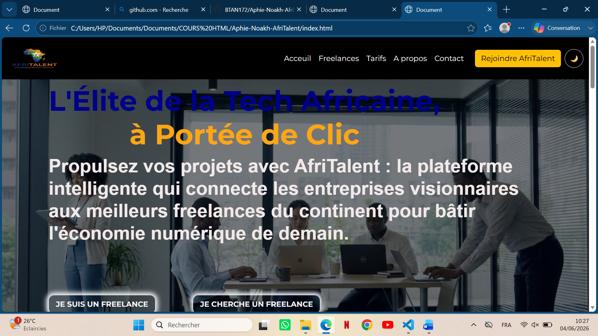
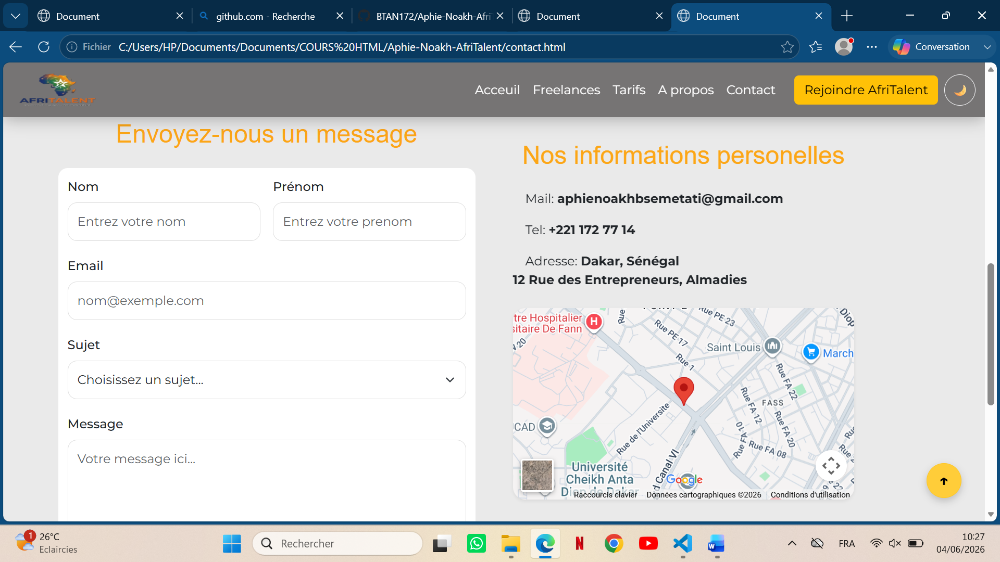

# AfriTalent
Projet fil rouge — Plateforme de mise en relation entre freelances africains et clients.

Auteur : Aphie-Noakh B'SEME-TATI

Promotion : L1 Web — ISI

# Description
AfriTalent est un site vitrine moderne conçu pour une plateforme fictive de mise en relation entre les talents technologiques africains (développeurs, designers, experts Data/IA) et les entreprises du monde entier. Le projet a été réalisé dans le cadre du Semestre 2 pour démontrer la maîtrise des technologies web fondamentales, avec une interface responsive adoptant les tendances de 2026 comme le design Bento Grid.

# Technologies Utilisées
* **HTML5** : Structure sémantique et accessibilité (ARIA, rôles).

* **CSS3** : Layouts avancés (Flexbox, Grid), variables natives et animations personnalisées.

* **Bootstrap 5** : Système de grille, composants interactifs (Navbar, Cards, Modals, Accordions).

* **JavaScript** (Vanilla) : Manipulation du DOM, gestion d'événements et stockage local sans frameworks externes.

* **Git & GitHub** : Versionnage rigoureux et déploiement via GitHub Pages.

# Fonctionnalités Principales
* **Mode Sombre (Dark Mode)** : Toggle interactif avec persistance du choix via localStorage.

* **Interface Bento Grid** : Mise en page modulaire et asymétrique pour les sections clés.

* **Filtrage Dynamique** : Système de tri des profils de freelances par catégorie sans rechargement de page.

* **Animations au Scroll** : Compteurs statistiques animés et apparitions (fade-in) des sections via          IntersectionObserver.

* **Validation de Formulaire** : Contrôle complet côté client (Regex email, longueur de message) avec retours visuels.

* **Navigation Adaptative** : Navbar collante (sticky) qui change d'apparence au défilement.

# Aperçu du Projet

# Installation et Utilisation Locale
1.	Cloner le dépôt :
Bash
git clone https://github.com/BTAN172/Aphie-Noakh-AfriTalent.git
2.	Ouvrir le projet :
* **Naviguez dans le dossier du projet**.

* **Ouvrez le fichier index.html dans votre navigateur Web**.

3.	Déploiement :
* **Le site est également consultable en ligne via GitHub Pages**:  https://btan172.github.io/Aphie-Noakh-AfriTalent/ 

# Ressources Consultées
* **MDN Web Docs** : Références techniques HTML/JS.

* **Bootstrap Docs** : Documentation des composants UI.

* **Google Fonts** : Typographies expressives pour le design 2026.

* **W3C Validator** : Validation de la conformité du code.

